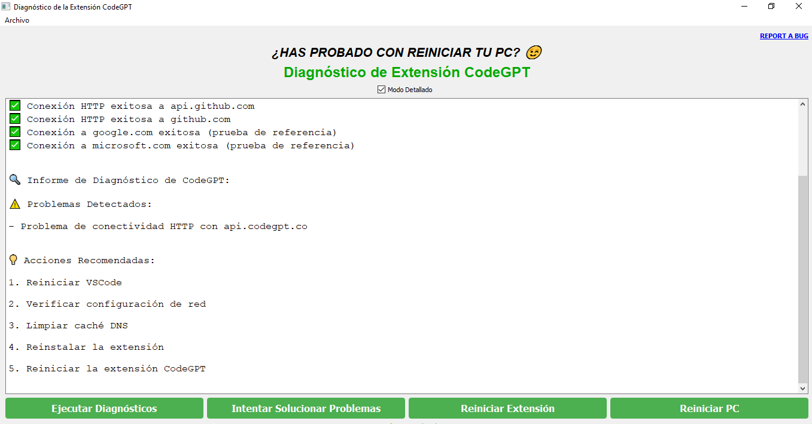

# Herramienta_Diagnóstico_Extensión_ Error_CodeGPT

La extensión CodeGPT es una herramienta muy útil para el trabajo de ciencia de datos. Sin embargo, en ocasiones puede presentar problemas al iniciar o mostrar errores inesperados. Para abordar estos inconvenientes, se ha desarrollado una herramienta de diagnóstico basada en la documentación oficial. Es importante tener en cuenta que, aunque esta herramienta puede ser útil, no siempre garantiza una solución, ya que a veces puede funcionar correctamente y otras no. En caso de problemas, se recomienda desinstalar y reinstalar la extensión, instalar versiones anteriores o simplemente verificar manualmente si hay contenedores Docker u otras aplicaciones que puedan estar interfiriendo con su puerto, revisar otras extensiones que utilicen el mismo puerto y reiniciar el sistema. Para más información, puedes consultar https://github.com/JudiniLabs/code-gpt-docs/issues si tu problema es similar.

En algunos casos, volver a una versión anterior de la extensión puede solucionar el problema debido a posibles conflictos generados por cambios recientes.

Es importante destacar que no soy parte de la empresa desarrolladora de CodeGPT y no me hago responsable del mal uso del código.

Se recomienda revisar y utilizar esta herramienta si la encuentras útil. Si deseas agregar mejoras, por favor, siéntete libre de hacerlo.

Saludos

## Herramienta de Diagnóstico para la Extensión CodeGPT
Esta aplicación de Python, construida con PyQt5, es una herramienta de diagnóstico diseñada para ayudar a los usuarios a identificar y resolver problemas que puedan estar impidiendo el correcto funcionamiento de la extensión CodeGPT en Visual Studio Code.

### Funcionalidad
La aplicación realiza las siguientes verificaciones y acciones:

#### Verificación de la Extensión CodeGPT
Busca y verifica si la extensión CodeGPT está instalada correctamente en Visual Studio Code.

#### Verificación de la Conectividad de Red
Realiza pruebas de resolución DNS y conectividad HTTP con los siguientes dominios: api.codegpt.co, storage.codegpt.co, api.github.com, github.com.
También verifica la conectividad a dominios de referencia como google.com y microsoft.com para identificar problemas generales de red.

#### Corrección Automática de Problemas
Problemas de DNS: Intenta limpiar la caché DNS del sistema.
Problemas de Red: Intenta reconfigurar el adaptador de red, deshabilitándolo y luego habilitándolo. También intenta restablecer la configuración de TCP/IP, y Winsock.

#### Interfaz de Usuario (UI)
Muestra los resultados del diagnóstico en un cuadro de texto fácil de leer, con fuente Courier y con la posibilidad de obtener una salida detallada.
Ofrece botones para ejecutar el diagnóstico, solucionar problemas y reiniciar el PC, también un botón para reiniciar la extensión.
Incluye un enlace para reportar errores en GitHub y un mensaje recordatorio para reiniciar el PC.
Los botones tienen un estilo personalizado para mejor usabilidad y apariencia.

#### Registro de Errores
Usa el módulo logging para registrar todo el proceso en un archivo troubleshooter.log.

#### Funcionalidades Adicionales
Ofrece la posibilidad de reiniciar la extensión CodeGPT.
Los botones de abajo tienen estilo y tooltip para mejorar la UI.

### Arquitectura del Código
Esta sección describe la arquitectura del código de la herramienta de diagnóstico.

WorkerThread: Esta clase hereda de QThread y se encarga de ejecutar las verificaciones de la extensión CodeGPT y la conectividad de red en un hilo separado, evitando que la interfaz de usuario se congele.

FixWorker: También hereda de QThread y realiza las acciones de corrección (limpieza de caché DNS, reconfiguración de red y restablecimiento TCP/IP) también en un hilo separado.

CodeGPTTroubleshooter: Es la clase principal que hereda de QMainWindow y se encarga de la gestión de la interfaz de usuario, la creación de los hilos de trabajo y la conexión de las señales y slots para la comunicación entre la interfaz y los hilos.

### Cómo Utilizar la Herramienta
Para utilizar esta herramienta, asegúrate de tener instaladas las siguientes dependencias de Python:

```bash
pip install PyQt5 PyQtWebEngine
```


